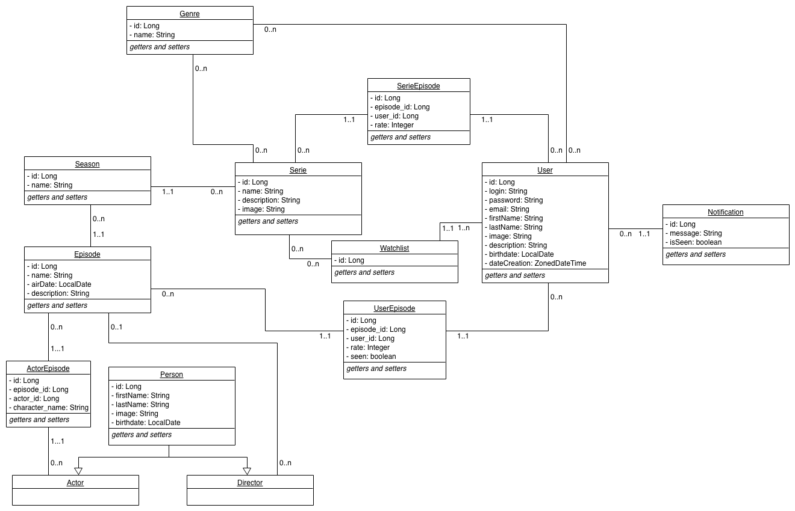

# Application de catalogue de séries (Projet Java 4)

## Description

CentraleSupélec OSY project - POOA. Coded by *Sebastien Lubineau*, *Romain Pelloie* and *Clément Dessoude*

Notre projet consistait à construire un site web pour pouvoir consulter une liste de séries, suivre certaines d’entre elles, recevoir des notifications à l’approche de la diffusion d’un nouvel épisode, etc.

Nous pouvons distinguer 2 parties dans notre projet :
Une partie backend, qui consiste à définir une API que va interroger la partie front.
Une partie frontend, qui expose une interface à l’utilisateur pour interagir avec notre application

## Back

Le back de notre application est écrit en Java, et basé sur le framework Spring.

Nous avons découpé notre projet Java en 5 grands packages :

- Un package contenant des fichiers de configuration (définition de constantes, de l’interaction avec la base de données...)
- Un package contenant les “controllers”, qui définissent les endpoints interrogeables de notre API
- Un package “models” contenant la définition de notre modèle de données.
- Un package “repository”, qui va permettre d’interagir avec notre base de donnée
- Un package “utils” dans lequel nous plaçons le plus possible de logique “métier”

### I/ Modèle de données (package models)

La modélisation et l’interaction entre ces entités est définie dans le diagramme UML ci-dessous :

Un sous-package DTO a été défini ici afin de spécifier la structure de certains échanges avec notre API.

### II/ Appels à la base de données (package repository)

L’utilisation de Spring Data JPA permet d’interagir facilement avec notre base de données. Nous avons défini dans ce package toutes les fonctions d’interaction entre notre application Java et la base de données. Certaines requêtes basiques sont interprétées automatiquement par Spring (`findAllEpisode()`, par exemple), tandis que nous avons spécifiées pour certaines requêtes plus complexe la requête SQL.

### III/ Les endpoint (package controller)

Tous les endpoints exposés par notre API sont définis ici. Chaque endpoint spécifie le type de requête effectuée (`GET`, `POST`, `PUT`, `DELETE`…), ainsi que les paramètres et le payload associés. Une documentation a été écrite pour chaque méthode afin de préciser ses entrées et sorties.

## Front

La partie front de notre projet est une application web écrite en javascript à l’aide du framework React. Elle se contente de d’afficher les données qu’elles reçoit du back-end lorsque l’utilisateur en a besoin.
Le front ne fait normalement pas parti du cadre du projet mais nous avons néanmoins décidé de faire un code propre respectant les bonnes pratiques que nous avions vues lors de nos différents stage de césure et en cours.

## Déploiement

Nous avons utilisé Docker afin de faciliter le déploiement de notre application chez n’importe quel utilisateur. Ainsi, notre projet ne dépend pas de la configuration présente sur la machine faisant tourner l’application, et ne nécessite que d’avoir Docker et une connection internet (pour télécharger les images Docker créées).

### Instructions détaillées:

- Installer Docker sur votre ordinateur
- Ouvrir une invite de commande et se placer dans le dossier du projet
- Aller dans le dossier docker : `cd docker`
- Télécharger l’image Docker du back : `docker pull clement26695/myseries_back`
- Télécharger l’image Docker du front : `docker pull clement26695/myseries_front`
- Lancer les trois conteneurs avec docker-compose : `docker-compose up`

Une fois ces opérations effectuées, et après avoir attendu une petite minute l'application est lancée. Vous pouvez alors :

- Voir le site en local, en allant à l’adresse: <http://localhost:5000>
- Faire des requêtes à l’API à <http://localhost:8080> (e.g <http://localhost:8080/api/serie/all>)
- Accéder à la base de données sur le port 13306 de votre ordinateur (`mysql --host=127.0.0.1 --port=13306 -u root myseries`)

### List des actions possibles

- You can browse some shows in the `Home` page
- If you click on a show, you will get some detailed information about it, and see the list of episode related to it
- You can mark some episodes as seen, rate them, etc.
- If you follow a show, and an episode of this show is aired in the next 24h, you will get a notification a 00:00. These notifications are listed in the `Notifications` section.
- You can have some basic recommandation about serie in the `Recommandation` page.
- You can see some statistics about what you watched or followed in the `Statistics` section

## Mot de la fin:

Le projet complet a été déployé sur un virtual private server que nous avons loué chez OVH et est accessible à l’addresse www.pooaseries.fr:5000
